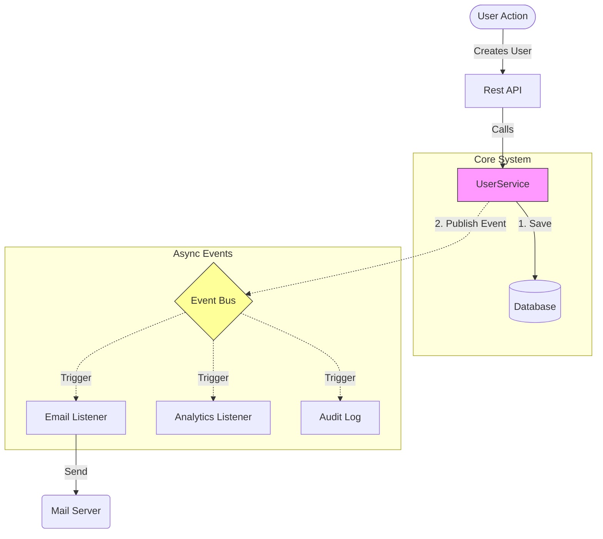
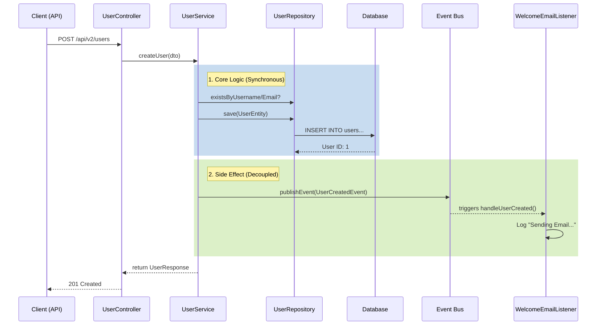

# Module 2: Event-Driven Architecture

## Goal
Decouple the "User Creation" logic from "Side Effects" (like sending emails) using **Events**.

## Why?
Refactoring `UserService` to simply publish an event allows us to add new behaviors (Notifications, Analytics, Logging) without modifying the core Service code. This adheres to the **Open/Closed Principle**.

## Architecture

### 1. High-Level Flowchart


### 2. Sequence Flow


## Changes from Module 1
1.  **Event**: Created `UserCreatedEvent` (a record holding data).
2.  **Listener**: Created `WelcomeEmailListener` annotated with `@EventListener`.
3.  **Publisher**: Injected `ApplicationEventPublisher` into `UserService`.

## Verification
When you create a user with `POST /api/v2/users`, check the logs:
```
[Module 2] EVENT RECEIVED: User Created
Sending Welcome Email to: ...
```
This proves the listener reacted to the event!
