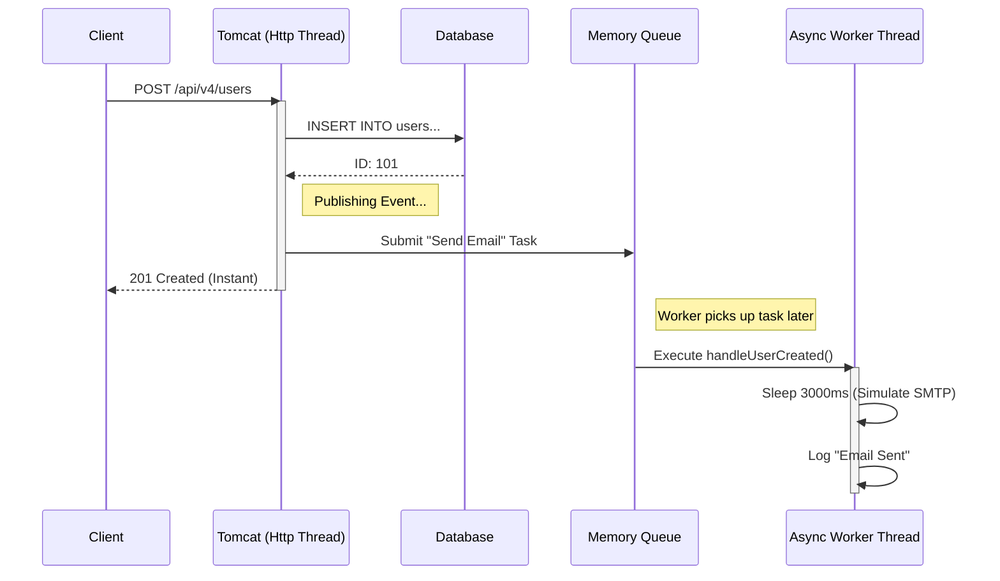

# Module 4: Asynchronous Processing (Fire & Forget)

## 1. The Core Problem: Latency
In **Module 2 (Event-Driven)**, we decoupled the `UserService` from the `EmailService`. However, the code was still **Synchronous**.

### The Scenario
Imagine a user registers on your site.
1.  Save User to DB (10ms)
2.  Generate Welcome PDF (500ms)
3.  Send Welcome Email via SMTP (2000ms)
4.  Send Slack Notification to Admin (200ms)

**Total User Wait Time**: ~2.7 seconds.
This is unacceptable for a modern web app. The user should not wait for an email to be sent.

---

## 2. The Solution: Asynchronous Execution
We use Spring Boot's `@Async` annotation to run specific methods in a **totally separate thread**. The main thread (handling the HTTP request) finishes immediately.

**New User Wait Time**: ~10ms (Just the DB save).

---

## 3. Architecture & Thread Pools

To achieve this, we don't just "create a thread" (which is expensive). We use a **Thread Pool**.

### Configuration (`AsyncConfig.java`)
```java
@Configuration
@EnableAsync
public class AsyncConfig {

    @Bean(name = "taskExecutor")
    public Executor taskExecutor() {
        ThreadPoolTaskExecutor executor = new ThreadPoolTaskExecutor();
        
        // 1. Core Pool Size: Minimum threads always alive (waiting for tasks)
        executor.setCorePoolSize(2); 
        
        // 2. Max Pool Size: Maximum threads created if Queue is full
        executor.setMaxPoolSize(5);  
        
        // 3. Queue Capacity: Buffer for tasks before creating new threads
        executor.setQueueCapacity(500);
        
        executor.setThreadNamePrefix("async-task-");
        executor.initialize();
        return executor;
    }
}
```

### How the Pool works (System Design)
1.  **Tasks 1-2**: Handled immediately by the **Core Threads**.
2.  **Tasks 3-500**: Placed in the **Queue**.
3.  **Task 503**: If Queue is full, new threads are created (up to **Max Pool Size**).
4.  **Task 506**: If Max Pool is full + Queue is full -> **Task Rejected** (Exception).

---

## 4. Sequence Diagram (Swimlanes)



---

## 5. Implementation Steps

### Step 1: Enable Async
Add `@EnableAsync` to a configuration class.

### Step 2: Annotate the Listener
```java
@Component
public class WelcomeEmailListener {

    @Async("taskExecutor") // <--- The Magic
    @EventListener
    public void handleUserCreated(UserCreatedEvent event) {
        // This runs in 'async-task-1', not 'http-nio-8080-exec-1'
        emailService.send(event.email());
    }
}
```
**Critical Rule**: The `@Async` method must be in a separate class (associated with a Bean) so Spring's proxy can intercept the call.

---

## 6. Verification (Manual Test)

### Sync Behavior (Module 2)
1.  Call API.
2.  Loader spins for 3 seconds.
3.  Response Received.

### Async Behavior (Module 4)
1.  Call API.
2.  Response Received **Instantly**.
3.  Check Server Logs:
    *   `10:00:01`: Controller returns 201.
    *   `10:00:04`: `[async-task-1]` Sending Welcome Email...

---

## 7. System Design: When to use @Async vs Message Queue?

We are using an **In-Memory** Async solution. Is this production ready?

| Feature | Spring @Async (In-Memory) | Message Queue (RabbitMQ / Kafka) |
| :--- | :--- | :--- |
| **Complexity** | Low (Just Annotations) | High (Infrastructure needed) |
| **Reliability** | **Low**: If server crashes, pending tasks in Memory Queue are **LOST**. | **High**: Messages are persisted on disk. |
| **Scalability** | Vertical (Limited by Server RAM/CPU) | Horizontal (Add more consumers) |
| **Use Case** | Non-critical emails, Logging, Analytics. | Financial transactions, Critical notifications. |

**Verdict**: Use `@Async` for simple, non-critical background tasks. Use **RabbitMQ/Kafka** for critical distributed systems.
