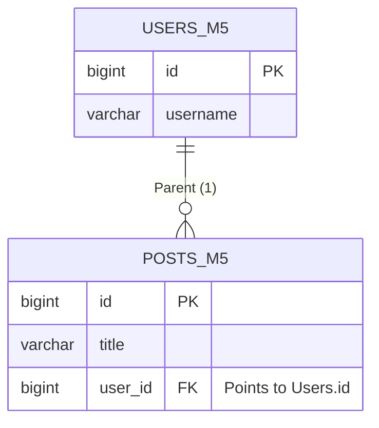

# Module 5: Database Relationships (One-to-Many)

## 1. Overview
Real-world systems are rarely single isolated tables. They are a web of interconnected entities.
*   Users have **Orders**.
*   Blogs have **Comments**.
*   Doctors have **Patients**.

In this module, we implement a **One-to-Many** relationship:
**ONE User** <--- has ---> **MANY Posts**.

---

## 2. The Data Model (Foreign Keys)
In a Relational Database (RDBMS), we don't store arrays in columns. We use a **Foreign Key** in the *Child* table pointing to the *Parent*.



*   **Parent**: `User` (The entity that *has* the list).
*   **Child**: `Post` (The entity that *holds* the link).

---

## 3. JPA Deep Dive: The Annotations

This is where many developers get stuck. Let's break down exactly what the annotations do.

### A. `@ManyToOne` (The Owning Side)
Placed on the `PostEntity`. This is the **most important** annotation because it maps to the actual physical database column (`user_id`).

```java
@ManyToOne(fetch = FetchType.LAZY)
@JoinColumn(name = "user_id", nullable = false)
private UserEntity user;
```
*   **`@JoinColumn(name="user_id")`**: Tells Hibernate: "Create a column named `user_id` in the `posts_m5` table".
*   **`FetchType.LAZY`**: Critical for performance. It means "Don't load the User data unless I explicitly ask for it". If you use `EAGER` (default for OneToOne), you might accidentally load the entire database.

### B. `@OneToMany` (The Inverse Side)
Placed on the `UserEntity`. This side is **Logical** (Java only). It does NOT exist in the database schema.

```java
@OneToMany(mappedBy = "user", cascade = CascadeType.ALL, orphanRemoval = true)
private List<PostEntity> posts = new ArrayList<>();
```
*   **`mappedBy = "user"`**: This is the magic. It tells Hibernate: "I don't own this relationship. Go look at the `user` field in `PostEntity` to know how to join."
    *   *Without this, Hibernate would create a third mapping table `users_posts`.*
*   **`cascade = CascadeType.ALL`**: Life-cycle propagation.
    *   If you **Delete** a User -> All their Posts are deleted (Cleanup).
    *   If you **Save** a User -> All new Posts in the list are saved.

---

## 4. System Design: The N+1 Select Problem

When querying relationships, a common performance killer is the **N+1 Problem**.

**Scenario**: You have 10 Users. You want to print their usernames and post titles.

**Bad (Naive) Approach**:
1.  `SELECT * FROM users` (1 Query).
2.  Loop through users. call `user.getPosts()`.
3.  Hibernate runs `SELECT * FROM posts WHERE user_id = ?` **10 times**.

**Total**: 1 + 10 = 11 Queries for just 10 rows.
**Impact**: If you have 1,000 users, that's 1,001 queries. Your DB will crash.

**Solution**: Use `JOIN FETCH` (Entity Graph) in your Repository to load everything in **1 Query**.
*(We will cover Query Optimization in a future module, but it's important to know this risk exists regarding OneToMany relationships)*.

---

## 5. Implementation Logic (`PostService`)

When creating a Child (Post), we **must** have the Parent (User).

```java
@Transactional
public PostResponse createPost(Long userId, CreatePostRequest request) {
    // 1. MUST validate the parent exists first!
    UserEntity user = userRepository.findById(userId)
            .orElseThrow(() -> new ResourceNotFoundException("User not found: " + userId));

    // 2. Link the child to the parent
    PostEntity post = new PostEntity(request.title(), request.body(), user);
    
    // 3. Save
    postRepository.save(post);
}
```

---

## 6. Verification

### Step 1: Create a User
**POST** `/api/v5/users`
```json
{ "username": "alice", "email": "alice@wonderland.com" }
```

### Step 2: Create a Post linked to Alice (ID: 1)
**POST** `/api/v5/users/1/posts`
```json
{
  "title": "Down the Rabbit Hole",
  "body": "It is quite dark down here."
}
```
**Response 201 Created**:
```json
{
  "id": 1,
  "title": "Down the Rabbit Hole",
  "body": "It is quite dark down here.",
  "createdAt": "..."
}
```

### Step 3: Verify Foreign Key Constraint
Trying to create a post for a non-existent user should fail gracefully (thanks to our Service logic + Exception Handler).

**POST** `/api/v5/users/9999/posts`
**Response 404 Not Found**:
```json
{
  "status": 404,
  "error": "Not Found",
  "message": "User not found with ID: 9999"
}
```
