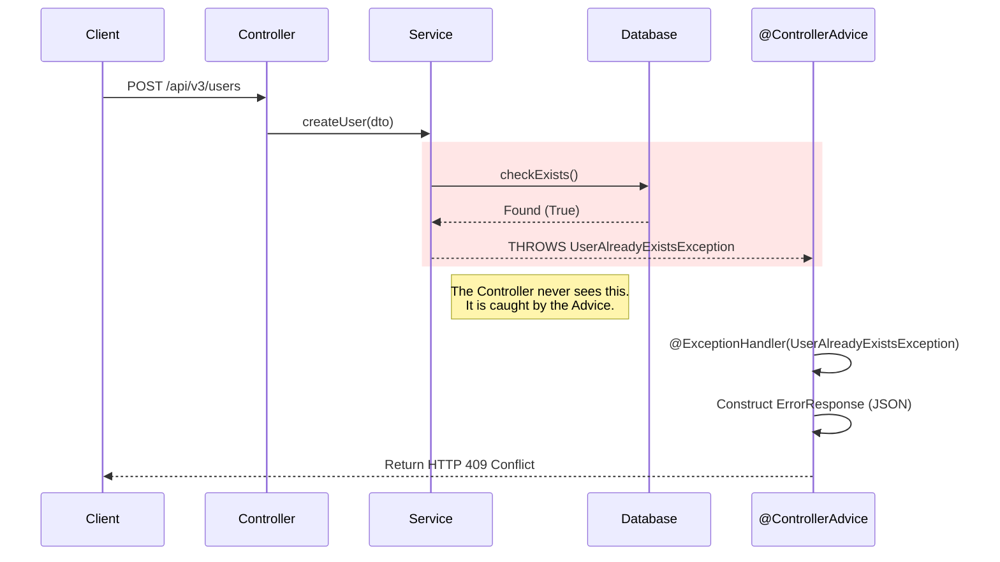

# Module 3: Global Exception Handling

## 1. Overview
In this module, we implement a **Centralized Error Handling** strategy. Instead of scattering try-catch blocks throughout our Controllers, we use Spring Boot's **AOP (Aspect-Oriented Programming)** features to handle errors globally. This ensures that our API clients always receive a consistent, predictable JSON error format, regardless of what went wrong.

---

## 2. The Problem: "Whitelabel Error Page"
By default, when your Spring Boot application throws an exception (e.g., `RuntimeException`), the server returns a generic 500 error or a HTML "Whitelabel Error Page".

**Why this is bad:**
1.  **Inconsistent**: Clients expect JSON, but might get HTML.
2.  **Uninformative**: "Internal Server Error" hides the actual problem (e.g., "Username taken").
3.  **Security Risk**: Stack traces can leak internal class names and paths.

---

## 3. The Architecture (Solution)
We introduce a `GlobalExceptionHandler` component that sits between our API Layer and the Client. It acts as an **Interceptor** for all exceptions.



---

## 4. Key Components

### A. The Custom Exception
We create semantic exceptions that match our business domain.
*   **File**: `UserAlreadyExistsException.java`
*   **Purpose**: usage of this exception clearly signals a conflict in the business rules.

### B. The Error Model (DTO)
We define a strict contract for what an error looks like.
```java
public record ErrorResponse(
    LocalDateTime timestamp,
    int status,
    String error,
    String message,
    String path
) {}
```

### C. The Global Handler (@RestControllerAdvice)
This is the magic component.
*   **`@RestControllerAdvice`**: Tells Spring "Apply this logic to ALL Controllers".
*   **`@ExceptionHandler(Type.class)`**: Tells Spring "If this specific Exception is thrown, run this method".

---

## 5. Implementation Details

### Handling Business Errors (409 Conflict)
When a user tries to register with an existing email, we throw `UserAlreadyExistsException`. The handler acts as follows:

```java
@ExceptionHandler(UserAlreadyExistsException.class)
public ResponseEntity<ErrorResponse> handleUserExists(UserAlreadyExistsException ex, HttpServletRequest request) {
    // 1. Create the standardized error JSON
    ErrorResponse error = new ErrorResponse(
            LocalDateTime.now(),
            HttpStatus.CONFLICT.value(),     // 409
            "Conflict",
            ex.getMessage(),                 // "Username already taken"
            request.getRequestURI()
    );
    // 2. Return it with the correct HTTP Status
    return new ResponseEntity<>(error, HttpStatus.CONFLICT);
}
```

### Handling Validation Errors (400 Bad Request)
If a user sends an empty username, Spring's `@Valid` annotation throws a `MethodArgumentNotValidException`. We catch this too!

```java
@ExceptionHandler(MethodArgumentNotValidException.class)
public ResponseEntity<ErrorResponse> handleValidation(MethodArgumentNotValidException ex) {
    // Extract specific field errors (e.g., "username: must not be blank")
    String details = ex.getBindingResult().getFieldErrors().stream()
            .map(err -> err.getField() + ": " + err.getDefaultMessage())
            .collect(Collectors.joining(", "));
            
    // Return 400 Bad Request
    return new ResponseEntity<>(..., HttpStatus.BAD_REQUEST);
}
```

---

## 6. HTTP Status Strategy
We map Java Exceptions to HTTP Status Codes:

| Exception Type | HTTP Status | Meaning |
| :--- | :--- | :--- |
| `MethodArgumentNotValidException` | **400 Bad Request** | The client sent invalid specific data (missing fields). |
| `UserAlreadyExistsException` | **409 Conflict** | The request conflicts with current state (duplicate). |
| `ResourceNotFoundException` | **404 Not Found** | The requested ID does not exist. |
| `Exception` (Catch-All) | **500 Internal Error** | Something unexpected happened (Bug/DB Crash). |

---

## 7. Verification

### Test 1: Duplicate User
**Action**: Send a POST request with a username that already exists.
**Result**:
```json
{
    "timestamp": "2024-03-20T10:15:30",
    "status": 409,
    "error": "Conflict",
    "message": "Username 'john_doe' is already taken",
    "path": "/api/v3/users"
}
```

### Test 2: Invalid Input
**Action**: Send a POST request with `"username": ""` (empty).
**Result**:
```json
{
    "timestamp": "2024-03-20T10:16:00",
    "status": 400,
    "error": "Bad Request",
    "message": "Validation Failed: username: must not be blank",
    "path": "/api/v3/users"
}
```
