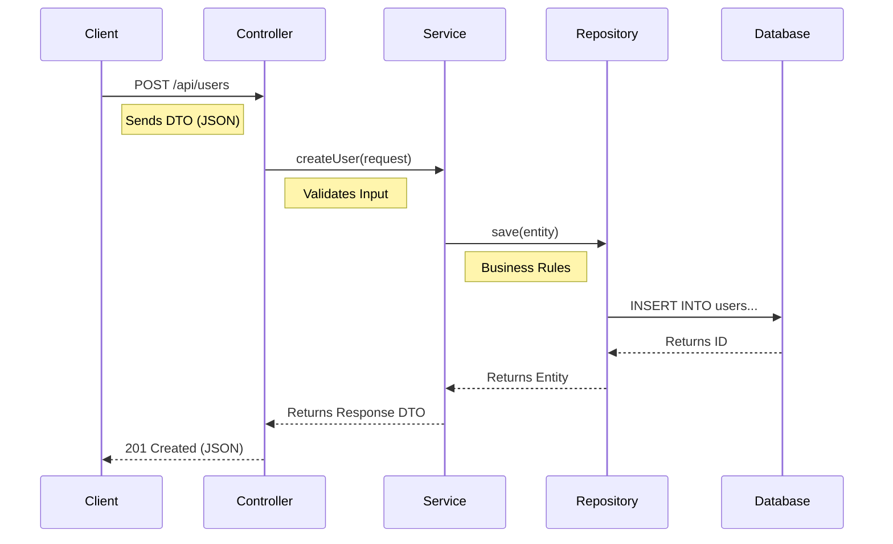

# Module 1: Layered Architecture

## Goal
Establish a clean separation of concerns using **Controller**, **Service**, and **Repository** layers.

## Structure
*   `com.learning.systemdesign.module1.user.UserController`: Handles HTTP.
*   `com.learning.systemdesign.module1.user.UserService`: Handles Business Logic.
*   `com.learning.systemdesign.module1.user.UserRepository`: Handles Database.

## Key Concept
The **Service Layer** protects the Domain model and ensures consistency.
We use **DTOs** (`CreateUserRequest`, `UserResponse`) to decouple the API from the Database.

## Request Flow

