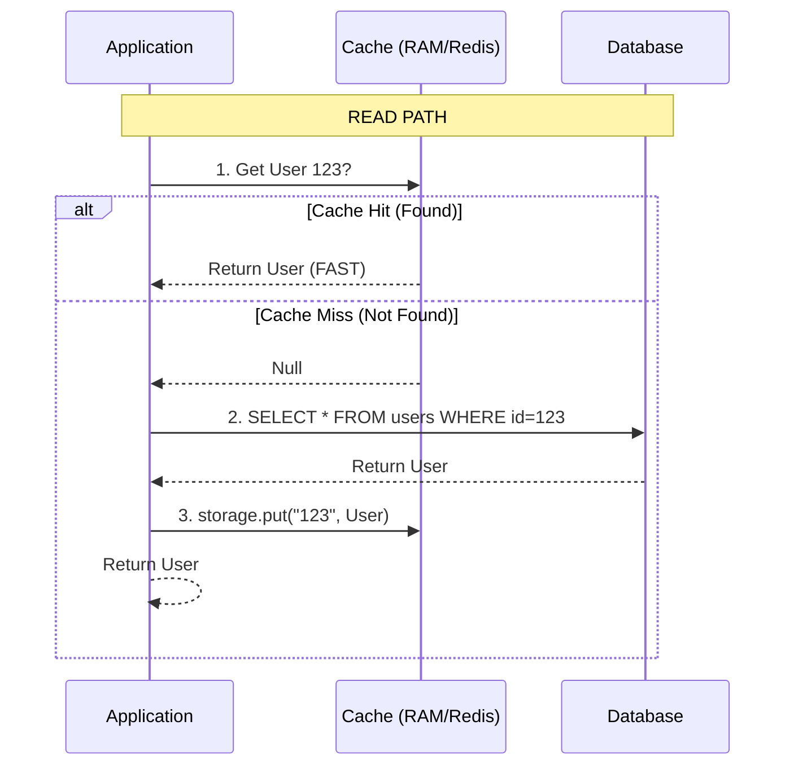

# Module 6: Caching Strategy (Performance)

## 1. Overview
In a high-scale distributed system, the **Database is the bottleneck**.
*   **Disk I/O**: Slow (milliseconds).
*   **RAM Access**: Fast (nanoseconds).
*   **Network**: Variable.

**Caching** is the practice of storing the result of expensive operations (like DB queries) in fast, temporary storage (RAM).
**Goal**: Reduce latency from ~50ms to ~1ms.

---

## 2. The Pattern: Cache-Aside (Lazy Loading)
We strictly follow the **Cache-Aside** pattern. Failure to understand this flow leads to bugs.



### Why Cache-Aside?
*   **Resilient**: If the Cache fails (e.g., Redis goes down), the system doesn't crash. It seamlessly falls back to the Database (though slower).
*   **Lazy**: Only requested data is cached. We don't fill memory with unused data.

---

## 3. Implementation Logic (`@Cacheable`)

Spring Boot handles the "Hit/Miss" logic automatically via AOP (Aspect Oriented Programming).

```java
// Logic:
// IF cache.get("users", id) != null -> RETURN cache value (Skip method body)
// ELSE -> Run method body (DB path) -> cache.put("users", id, returnValue)
@Cacheable(value = "users", key = "#id")
public UserResponse getUserById(Long id) {
    // This line is ONLY executed on Cache Miss
    return userRepository.findById(id)...
}
```

### Key Parameters
*   **`value`**: The name of the Cache (e.g., "users", "products"). Think of this as a Map Name.
*   **`key`**: The unique identifier within that map. Defaults to method params.

---

## 4. System Design: The "Stale Data" Problem
Caching introduces a massive trade-off: **Consistency vs. Performance**.

**Scenario**:
1.  User updates their profile name from "Alice" to "Al".
2.  Database is updated to "Al".
3.  **Cache still has "Alice"**.
4.  Subsequent GET requests return "Alice" (Stale Data).

### Solution: Cache Eviction (`@CacheEvict`)
We must explicitly delete the old entry when data changes.

```java
// Logic: Run method body (Update DB) -> THEN delete "users":id from Cache
@CacheEvict(value = "users", key = "#id")
public void updateUser(Long id, UpdateUserRequest req) {
    userRepository.save(...);
}
```

*   **`@CachePut`**: Updates the cache with the new value (instead of deleting). Useful if the read-ratio is extremely high immediately after write.

---

## 5. In-Memory vs. Distributed Cache (Redis)
We used `ConcurrentMapCacheManager` (In-Memory) for simplicity.

| Feature | In-Memory (This Module) | Distributed (Redis) |
| :--- | :--- | :--- |
| **Speed** | Fastest (Heap memory) | Fast (Network overhead) |
| **Capacity** | Limited by JVM Heap (OOM risk) | Terabytes (Separate Cluster) |
| **Consistency** | **Bad**: Each server has its own empty cache. | **Good**: All servers share one cache. |
| **Persistence** | Data lost on restart. | Can persist to disk. |

**Production Rule**: Use In-Memory for small, static data (Config). Use **Redis** for shared, dynamic data (Users, Sessions).

---

## 6. Verification Steps

### Step 1: Populate Data
**POST** `/api/v6/users` -> `{"username": "flash", "email": "run@fast.com"}` (ID: 1)

### Step 2: Observe "Cache Miss"
**GET** `/api/v6/users/1`
*   **Console Log**: `Fetching User from Database for ID: 1`
*   **Explanation**: Cache was empty. DB was hit.

### Step 3: Observe "Cache Hit"
**GET** `/api/v6/users/1` (Run this 5 times)
*   **Console Log**: (Empty)
*   **Explanation**: The Request never touched the Service method body. It returned instantly from RAM.

